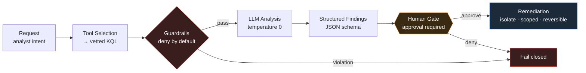

# 🛡️ Agentic Threat-Hunt Agent

> **Cyber Range track** · `request → KQL → guardrails → hunt → remediation`
> Citadel Threat Intelligence Group

An LLM-driven threat-hunting agent for Microsoft Sentinel / MDE. Deterministic code
orchestrates the loop; the model **analyzes, it does not drive**. Every destructive
action is human-gated, every guardrail **fails closed**.

<p>
  
  
  
  
  
</p>

---

## ⭐ Five Golden Rules

> **Break one and the project fails.**

| # | Rule | Why |
|---|------|-----|
| 1 | **Fail closed** | On any uncertainty, stop or deny — never proceed by default. |
| 2 | **Read before write** | No remediation wired until the read-only hunt is rock solid. |
| 3 | **No autonomous isolation** | A human approves every destructive action. No exceptions. |
| 4 | **Evidence is real or it doesn't ship** | No fabricated log lines, no inferred IOCs. |
| 5 | **No secrets in the repo** | Keys live in environment variables. Always. |

---

## 🧭 Architecture



**Module boundaries** — each owns one responsibility:
`tools` · `guardrails` · `prompts` · `output` · `remediation`

---

## ✅ Build Sequence

Work top to bottom. Don't wire section _n+1_ until _n_ holds.

### 0 · Setup & Access
> _Prevents: leaked keys and over-broad permissions._
- [ ] LLM API key in an environment variable — never in code or git history
- [ ] Agent lives in a **private** repo, separate from your public brand site
- [ ] Sentinel / MDE access scoped **read-only** for the hunt phase (least privilege)
- [ ] A cost/billing alert is set on the LLM account before the first run

### 1 · Flowchart Before Code
> _Prevents: building a tangle you can't reason about._
- [ ] Diagram the loop: request → tool selection → KQL → guardrails → LLM analysis → structured findings → (gated) remediation
- [ ] Each module owns one responsibility: tools / guardrails / prompts / output / remediation
- [ ] Every human-in-the-loop gate is marked on the diagram
- [ ] You've defined what **"fail closed"** means at each step

### 2 · Baseline Agent Loop
> _Prevents: the LLM silently driving the whole system._
- [ ] Control flow is deterministic code; the LLM analyzes, it does not orchestrate
- [ ] Every step emits a log line (its input, its decision, its output)
- [ ] Errors stop the loop and surface — no silent continue, no swallowed exceptions

### 3 · Tool Selection: Request → KQL
> _Prevents: arbitrary or unsafe queries against prod._
- [ ] User intent maps to a **vetted** query/table — the model never freeforms raw KQL against production
- [ ] The chosen table is validated against the allowlist **before** any query runs
- [ ] Time range and scope are parameters with hard caps, not model-chosen
- [ ] `GUARDRAILS.validate_table()` / `enforce_time_window()`

### 4 · Guardrails
> _Prevents: cost blowups, data leakage, off-limits access._
- [ ] Allowlists for tables, fields, and models — **deny by default**
- [ ] Time-window + row/byte caps applied **before** anything reaches the model
- [ ] PII redaction (tokenize) before the LLM; rehydrate IOCs after analysis
- [ ] Every guardrail **fails closed** on violation
- [ ] `GUARDRAILS.py` → `guard_request`, `cap_rows_bytes`, `redact_pii`

### 5 · Prompt Engineering / Threat Hunt
> _Prevents: hallucinated findings an analyst acts on._
- [ ] A system identity locks SOC-analyst behavior
- [ ] Per-table playbooks are injected as context for the log type in hand
- [ ] Output schema is enforced **structurally** (JSON schema), not just asked for in prose
- [ ] Hard rules: verbatim `log_lines`, **extracted-not-inferred** IOCs, empty findings is valid
- [ ] `temperature 0` for determinism and repeatability
- [ ] `PROMPT_MANAGEMENT.py` → system prompt, table prompts, `FINDINGS_JSON_SCHEMA`

### 6 · Output Handling
> _Prevents: garbage flowing downstream undetected._
- [ ] Validate the model's JSON against the schema; reject or retry on mismatch
- [ ] Rehydrate redacted IOCs back to real values for the analyst
- [ ] Confirm MITRE mapping, confidence, and recommendations are present on **every** finding

### 7 · Agentic Remediation: VM Isolation &nbsp;⚠️ HIGH RISK
> _Prevents: a catastrophic automated action you can't undo._
- [ ] **Human approval is REQUIRED** before any isolate / disable / block. No exceptions.
- [ ] Plan-then-apply: show the action and target, dry-run, then execute on confirmation
- [ ] Blast-radius cap: one host/account per action — never fleet-wide in a single call
- [ ] Remediation uses **separate, tightly-scoped credentials** — not the hunt's read creds
- [ ] Full audit log; every action is reversible
- [ ] `GUARDRAILS.REMEDIATION_POLICY` / `authorize_remediation()`

### 8 · Validate Before You Trust It
> _Prevents: shipping an agent that lies or misses._
- [ ] Test against a known-good / purple-team dataset with planted findings
- [ ] Confirm it finds the true positives you planted
- [ ] Confirm it returns **empty on clean data** — no invented findings
- [ ] Measure token cost per run and set a ceiling
- [ ] Hand-review a sample of runs before you trust the output

### 9 · Always-On (every phase)
> _Prevents: the slow-burn mistakes that sink projects._
- [ ] Secrets never enter the repo (the deploy script's secret scan is your safety net)
- [ ] Prompts are versioned so you can correlate output quality to changes
- [ ] Least privilege everywhere; the agent can only touch what it must
- [ ] Observability: you can reconstruct **what** the agent did, and **why**, from logs

---

## 🗂️ Repository Layout

```text
.
├── GUARDRAILS.py          # allowlists, caps, redaction, remediation policy
├── PROMPT_MANAGEMENT.py   # system prompt, per-table playbooks, findings schema
├── agent/                 # deterministic control loop (LLM = analysis only)
├── tools/                 # request → vetted KQL mapping
├── remediation/           # human-gated, scoped, reversible actions
└── tests/                 # purple-team dataset + planted findings
```

---

## 🔒 Threat Model in One Line

> The model can be wrong, prompt-injected, or hallucinate — so it never holds
> credentials, never orchestrates, and never touches a host without a human `yes`.

---

<sub>Built from the Cyber Range module outline plus existing `PROMPT_MANAGEMENT.py` and
`GUARDRAILS.py`. This maps the architecture, not lesson-specific content — paste the
flowchart details to tailor it further.</sub>

